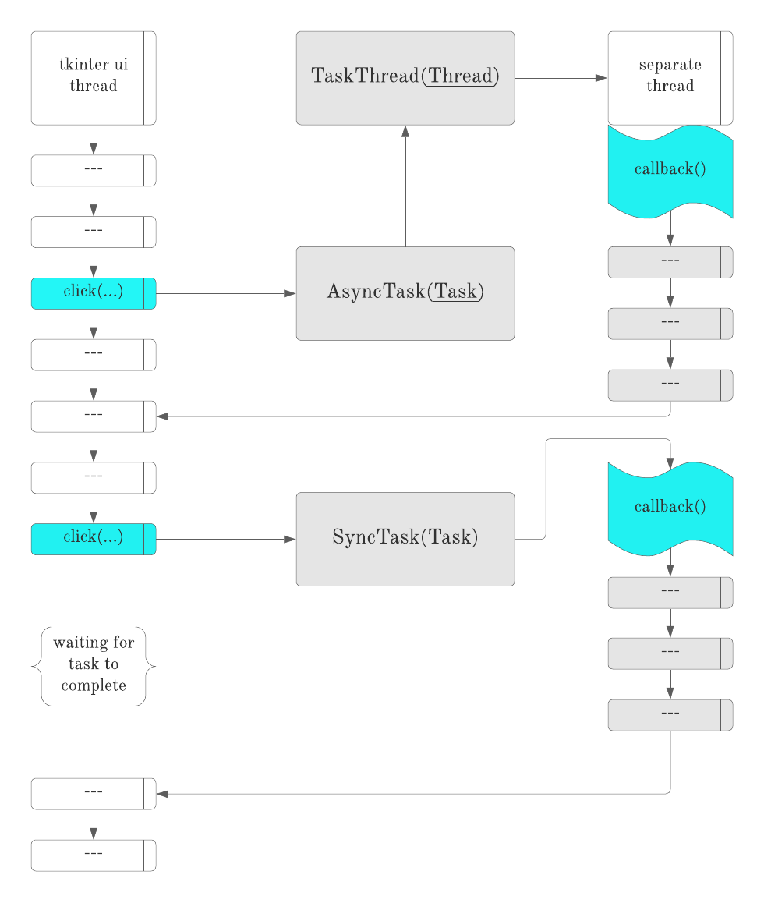

<a href="https://docs.python.org/3/library/tkinter.html">Tkinter</a> is a popular GUI api and suitable for most of the `python` apps. 

However, it doesn't have built-in asynchronous callback execution forcing `i/o` thread to wait for some `time_consuming_execution(...)` callback to finish.

> They say a good example is worth 2077 pages of API documentation, a million directives, or a thousand words...

This little demo provides extensible and customizable example showcasing differencies between `async` vs `sync` tasks and how you can pass your own callback, by wrapping it around with corresponding class. 

